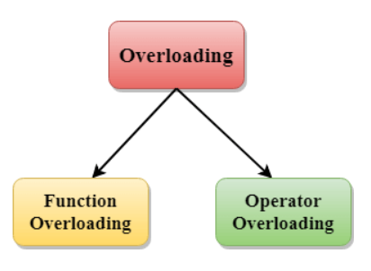
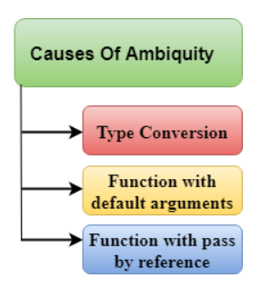

## <u>Overloading (Function and Operator)</u>

In C++ overloading we overload,

- methods,
- constructors, and
- indexed properties

### Types of overloading 



- Function overloading
- Operator overloading

### Function Overloading

Function Overloading is defined as the process of having two or more function with the same name, but different in parameters is known as function overloading in C++. In function overloading, the function is redefined by using either different types of arguments or a different number of arguments. It is only through these differences compiler can differentiate between the functions.

The advantage of Function overloading is that it increases the readability of the program because you don't need to use different names for the same action.

eg:-
```c++
#include <iostream>    
using namespace std;    
class Cal {    
public:    
static int add(int a,int b){      
    return a + b;      
}      

static int add(int a, int b, int c)      
{      
    return a + b + c;      
}      
};     

int main(void) {    
    Cal C;                           //     class object declaration.   
    cout<<C.add(10, 20)<<endl;      
    cout<<C.add(12, 20, 23);     
   return 0;    
}    
```
Output

```
30
55
```

### Function Overloading and Ambiguity

When the compiler is unable to decide which function is to be invoked among the overloaded function, this situation is known as function overloading.

When the compiler shows the ambiguity error, the compiler does not run the program.

Causes of Function Overloading:

- Type Conversion.
- Function with default arguments.
- Function with pass by reference.



#### Type Conversion.

```c++
#include<iostream>  
using namespace std;  
void fun(int);  
void fun(float);  
void fun(int i)  
{  
    std::cout << "Value of i is : " <<i<< std::endl;  
}  

void fun(float j)  
{  
    std::cout << "Value of j is : " <<j<< std::endl;  
}  

int main()  
{  
    fun(12);  
    fun(1.2);  
    return 0;  
}  
```

The above example shows an error "call of overloaded 'fun(double)' is ambiguous". The fun(10) will call the first function. The fun(1.2) calls the second function according to our prediction. But, this does not refer to any function as in C++, all the floating point constants are treated as double not as a float. If we replace float to double, the program works. Therefore, this is a type conversion from float to double.

#### Function with default arguments.

```c++
#include<iostream>  
using namespace std;  
void fun(int);  
void fun(int,int);  

void fun(int i)  
{  
    std::cout << "Value of i is : " <<i<< std::endl;  
}  

void fun(int a,int b=9)  
{  
    std::cout << "Value of a is : " <<a<< std::endl;  
    std::cout << "Value of b is : " <<b<< std::endl;  
}  

int main()  
{  
    fun(12);  
   
    return 0;  
}  
```

The above example shows an error "call of overloaded 'fun(int)' is ambiguous". The fun(int a, int b=9) can be called in two ways: first is by calling the function with one argument, i.e., fun(12) and another way is calling the function with two arguments, i.e., fun(4,5). The fun(int i) function is invoked with one argument. Therefore, the compiler could not be able to select among fun(int i) and fun(int a,int b=9).

#### Function with pass by reference

```c++
#include <iostream>  
using namespace std;  
void fun(int);  
void fun(int &);   

int main()  
{  
int a=10;  
fun(a); // error, which f()?  
return 0;  
}  

void fun(int x)  
{  
std::cout << "Value of x is : " <<x<< std::endl;  
}  

void fun(int &b)  
{  
std::cout << "Value of b is : " <<b<< std::endl;  
}  
```

The above example shows an error "call of overloaded 'fun(int&)' is ambiguous". The first function takes one integer argument and the second function takes a reference parameter as an argument. In this case, the compiler does not know which function is needed by the user as there is no syntactical difference between the fun(int) and fun(int &).


### Operators Overloading

Operator overloading is a compile-time polymorphism in which the operator is overloaded to provide the special meaning to the user-defined data type. Operator overloading is used to overload or redefines most of the operators available in C++. It is used to perform the operation on the user-defined data type. For example, C++ provides the ability to add the variables of the user-defined data type that is applied to the built-in data types.

The advantage of Operators overloading is to perform different operations on the same operand.

Operator that cannot be overloaded,

- Scope operator (::)
- Sizeof
- member selector(.)
- member pointer selector(*)
- ternary operator(?:)

#### Rules for Operator Overloading

- Existing operators can only be overloaded, but the new operators cannot be overloaded.
- The overloaded operator contains atleast one operand of the user-defined data type.
- We cannot use friend function to overload certain operators. However, the member function can be used to overload those operators.
- When unary operators are overloaded through a member function take no explicit arguments, but, if they are overloaded by a friend function, takes one argument.
- When binary operators are overloaded through a member function takes one explicit argument, and if they are overloaded through a friend function takes two explicit arguments.

eg:-
```c++
#include <iostream>    
using namespace std;    
class Test    
{    
private:    
    int num;    
public:    
    Test(): num(8){}    
    void operator ++()         {     
        num = num+2;     
    }    
    
    void Print() {     
        cout<<"The Count is: "<<num;     
    }    
};    

int main()    
{    
    Test tt;    
    ++tt;  // calling of a function "void operator ++()"    
    tt.Print();    
    return 0;    
}  
```

Output

```
The Count is: 10
```

with binary operators

```c++
#include <iostream>  
using namespace std;  
class A  
{  
    
int x;  
public:  
    A(){}  
    A(int i)  
    {  
       x=i;  
    }  
    void operator+(A);  
    void display();  
};  
  
void A :: operator+(A a)  
{  
     
    int m = x+a.x;  
    cout<<"The result of the addition of two objects is : "<<m;  
  
}  

int main()  
{  
    A a1(5);  
    A a2(4);  
    a1+a2;  
    return 0;  
}  
```

Output

```
The result of the addition of two objects is : 9 
```


