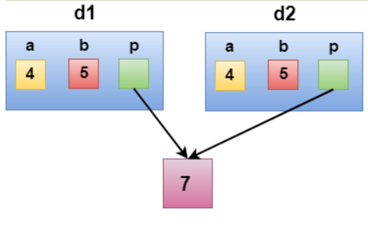
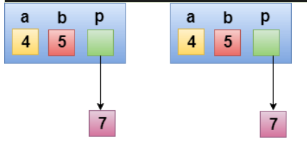

## <u>Copy Constructor</u>

A Copy constructor is an overloaded constructor used to declare and initialize an object from another object.

Copy Constructor has two types

- Default Copy constructor: The compiler defines the default copy constructor. If the user defines no copy constructor, compiler supplies its constructor.
- User Defined constructor: The programmer defines the user-defined constructor.

eg:-

```c++
#include <iostream>  
using namespace std;  
class A  
{  
public:  
int x;  
A(int a)                // parameterized constructor.  
{  
	x=a;  
}  
A(A &i)               // copy constructor  
{  
	x = i.x;  
}  
};  
int main()  
{  
	A a1(20);               // Calling the parameterized constructor.  
	A a2(a1);                //  Calling the copy constructor.  
	cout<<a2.x;  
	return 0;  
}  
```

Output

```
20
```

Two types of copies are produced by the constructor

- Shallow copy
- Deep copy

### Shallow Copy

- The default copy constructor can only produce the shallow copy.
- A Shallow copy is defined as the process of creating the copy of an object by copying data of all the member variables as it is.

eg:-

```c++
#include <iostream>  
  
using namespace std;  
class Demo  
{  
int a;  
int b;  
int *p;  
public:  
Demo()  
{  
	p=new int;  
}  
void setdata(int x,int y,int z)  
{  
	a=x;  
	b=y;  
	*p=z;  
}  
void showdata()  
{  
	std::cout << "value of a is : " <<a<< std::endl;  
	std::cout << "value of b is : " <<b<< std::endl;  
	std::cout << "value of *p is : " <<*p<< std::endl;  
}  
};  
int main()  
{  
	Demo d1;  
	d1.setdata(4,5,7);  
	Demo d2 = d1;  
	d2.showdata();  
	return 0;  
}  
```

Output

```
value of a is : 4   
value of b is : 5  
value of *p is : 7 
```



### Deep copy

Deep copy dynamically allocates the memory for the copy and then copies the actual value, both the source and copy have distinct memory locations. In this way, both the source and copy are distinct and will not share the same memory location. Deep copy requires us to write the user-defined constructor.

eg:-

```c++
#include <iostream>  
using namespace std;  
class Demo  
{  
public:  
	int a;  
	int b;  
	int *p;  

	Demo()  
	{  
		p=new int;  
	}  
	Demo(Demo &d)  
	{  
		a = d.a;  
		b = d.b;  
		p = new int;  
		*p = *(d.p);  
	}  
	void setdata(int x,int y,int z)  
	{  
		a=x;  
		b=y;  
		*p=z;  
	}  
	void showdata()  
	{  
		std::cout << "value of a is : " <<a<< std::endl;  
		std::cout << "value of b is : " <<b<< std::endl;  
		std::cout << "value of *p is : " <<*p<< std::endl;  
	}  
};  
int main()  
{  
	Demo d1;  
	d1.setdata(4,5,7);  
	Demo d2 = d1;  
	d2.showdata();  
	return 0;  
}  
```

Output

```
value of a is : 4   
value of b is : 5   
value of *p is : 7   
```


