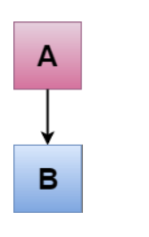
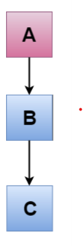
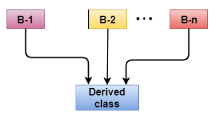
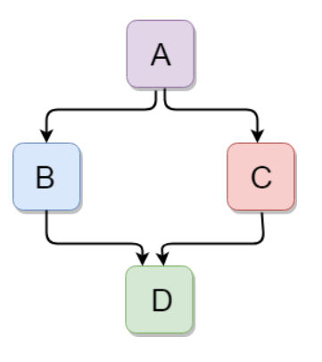

## <u>Inheritance</u>

In C++, inheritance is a process in which one object acquires all the properties and behaviors of its parent object automatically. In such way, you can reuse, extend or modify the attributes and behaviors which are defined in other class.

In C++, the class which inherits the members of another class is called derived class and the class whose members are inherited is called base class. The derived class is the specialized class for the base class.

C++ supports five types of inheritance:

- Single inheritance
- Multiple inheritance
- Hierarchical inheritance
- Multilevel inheritance
- Hybrid inheritance

### Single Inheritance

Single inheritance is defined as the inheritance in which a derived class is inherited from the only one base class.



```c++
#include <iostream>  
using namespace std;  
class Account {  
public:  
   float salary = 60000;   
 };  
class Programmer: public Account {  
public:  
   float bonus = 5000;    
   };       
int main(void) {  
     Programmer p1;  
     cout<<"Salary: "<<p1.salary<<endl;    
     cout<<"Bonus: "<<p1.bonus<<endl;    
    return 0;  
}  
```
Output

```
Salary: 60000
Bonus: 5000
```

### Multilevel Inheritance

When one class inherits another class which is further inherited by another class, it is known as multi level inheritance in C++. Inheritance is transitive so the last derived class acquires all the members of all its base classes.



```c++
#include <iostream>  
using namespace std;  
class Animal {  
public:  
 void eat() {   
    cout<<"Eating..."<<endl;   
 }    
   };  
class Dog: public Animal   
   {    
public:  
     void bark(){  
    cout<<"Barking..."<<endl;   
     }    
   };   
class BabyDog: public Dog   
   {    
public:  
     void weep() {  
    cout<<"Weeping...";   
     }    
   };   
int main(void) {  
    BabyDog d1;  
    d1.eat();  
    d1.bark();  
     d1.weep();  
     return 0;  
}
```

Output

```
Eating...
Barking...
Weeping...
```

### Multiple Inheritance

Multiple inheritance is the process of deriving a new class that inherits the attributes from two or more classes.



```c++
#include <iostream>  
using namespace std;  
class A  
{  
protected:  
     int a;  
public:  
    void get_a(int n)  
    {  
        a = n;  
    }  
};  
  
class B  
{  
protected:  
    int b;  
public:  
    void get_b(int n)  
    {  
        b = n;  
    }  
};  
class C : public A,public B  
{  
public:  
    void display()  
    {  
        std::cout << "The value of a is : " <<a<< std::endl;  
        std::cout << "The value of b is : " <<b<< std::endl;  
        cout<<"Addition of a and b is : "<<a+b;  
    }  
};  
int main()  
{  
   C c;  
   c.get_a(10);  
   c.get_b(20);  
   c.display();  
  
    return 0;  
}  
```

Output

```
The value of a is : 10
The value of b is : 20
Addition of a and b is : 30
```

### Hybrid Inheritance

Hybrid inheritance is a combination of more than one type of inheritance.



```c++
#include <iostream>  
using namespace std;  
class A  
{  
protected:  
    int a;  
public:  
    void get_a()  
    {  
       std::cout << "Enter the value of 'a' : " << std::endl;  
       cin>>a;  
    }  
};  
  
class B : public A   
{  
protected:  
    int b;  
public:  
    void get_b()  
    {  
        std::cout << "Enter the value of 'b' : " << std::endl;  
       cin>>b;  
    }  
};  
class C   
{  
protected:  
    int c;  
public:  
    void get_c()  
    {  
        std::cout << "Enter the value of c is : " << std::endl;  
        cin>>c;  
    }  
};  
  
class D : public B, public C  
{  
protected:  
    int d;  
public:  
    void mul()  
    {  
    get_a();  
    get_b();  
    get_c();  
    std::cout << "Multiplication of a,b,c is : " <<a*b*c<< std::endl;  
    }  
};  
int main()  
{  
    D d;  
    d.mul();  
    return 0;  
}  
```
Output

```
Enter the value of 'a' :
10              
Enter the value of 'b' :    
20      
Enter the value of c is :   
30  
Multiplication of a,b,c is : 6000
```

### Hierarchical Inheritance

Hierarchical inheritance is defined as the process of deriving more than one class from a base class.


```c++
#include <iostream>  
using namespace std;  
class Shape                 // Declaration of base class.  
{  
public:  
    int a;  
    int b;  
    void get_data(int n,int m)  
    {  
        a= n;  
        b = m;  
    }  
};  
class Rectangle : public Shape  // inheriting Shape class  
{  
public:  
    int rect_area()  
    {  
        int result = a*b;  
        return result;  
    }  
};  
class Triangle : public Shape    // inheriting Shape class  
{  
public:  
    int triangle_area()  
    {  
        float result = 0.5*a*b;  
        return result;  
    }  
};  
int main()  
{  
Rectangle r;  
Triangle t;  
int length,breadth,base,height;  
std::cout << "Enter the length and breadth of a rectangle: " << std::endl;  
cin>>length>>breadth;  
r.get_data(length,breadth);  
int m = r.rect_area();  
std::cout << "Area of the rectangle is : " <<m<< std::endl;  
std::cout << "Enter the base and height of the triangle: " << std::endl;  
cin>>base>>height;  
t.get_data(base,height);  
float n = t.triangle_area();  
std::cout <<"Area of the triangle is : "  << n<<std::endl;  
return 0;  
}
```

Output

```
Enter the length and breadth of a rectangle:
23  
20  
Area of the rectangle is : 460          
Enter the base and height of the triangle:  
2   
5
Area of the triangle is : 5 
```